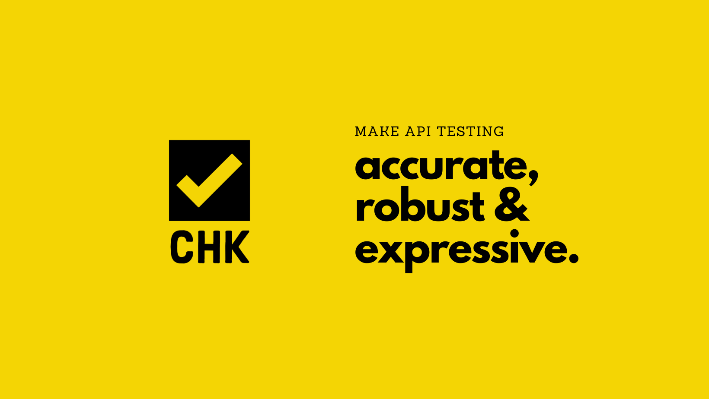

**chkware** (pronounced as */check:ware/*) is an API testing tool, a scriptable HTTP client, and a test specification management tool for the API era.

It is available as a command-line application. You write test specification files in a [YAML](https://yaml.org/)-based [DSL](https://en.wikipedia.org/wiki/Domain-specific_language). In that specification file you will define some structured configurations to be used for the following purpose:

- Create reusable http request specification. [alpha]
- Create reusable test specifications. [TBD]

Afterward, you run those test specification files with **chkware**, and get test results or even reuse them.

---

### Motivation

In today's world, API is one of the key fuels that drive business. It is the way web applications consume services from self-hosted or 3rd-party vendors. Recent technology movements are going to a fluid internet direction, where *vendor_A* have one API, *vendor_B* is another API provider, while we are the consumers (e-commerce, fin-tech) of those vendor APIs. We use those APIs to host our contents based on those APIs. Maybe we are *vendor_U* hosting more complex APIs on top of those. So, with the upcoming complexity of integration we need better tooling for API testing. Testing tools for modularize api testing.

API automation is playing a key role in this era. The benefits of API automation are clearly visible. There are plenty of tools to support all kinds of test automation. However, the complexity to create and maintain automated test cases using available tools is inescapable. No way it's quick to get started, or pick up without further education on the corresponding tools ecosystem. Furthermore, knowledge of the programming language that was used to develop the tools is also needed for advanced customization of test cases.

API testing tools are costly as well, in-term of licensing, setup and maintenance. Some tools are available for free for simple use-cases, but have complex licensing for increased usage, most of the time that aren't worthwhile. Also, commercial applications have limited community support, and knowledge exchange medium. Above that, of course, there are less and less open-source tools to cover these scenarios.

For these reasons, the solutions are less scaling for actual use-cases. With additional business knowledge (that is evergrowing) required to start and maintain tests, you also need:

1. Specific programming language knowledge, so it is not easy to jump-in quick
2. Added complexity of maintaining supporting software stack, so there are side effects 
3. Above all, maintaining test cases based on code is more complex if you don't design your test code architecture well in the early days.

So, clearly enough I think this situation needs to be improved. This is the motivation for **chkware**.

---

### Audiences

The focused users of **chkware** are everyone involved in an API project, given they have some testing basics. 

- People with zero programming knowledge need a tool that does not get in their way. 
- We need a tool that is relatively easy to write specifications, expressive, and customizable to the very core. 
- We need a tool that is very easy to learn, and fun to use.

In practical cases, software testers / QAs, developers, PM/POs, are the people who should be able to use it rigorously.

- This project is particularly helpful if you are developing an API oriented project.
- Test websites or web interfaces are not in the project focus for now.
- Also, seeding data, validating data in DB is out of this project scope for now.

---

### Platform support

This tool is tested to run on **Linux**, **Windows**, and **macOS** platform.

There is no native binary dependency, therefore it is expected on all the platform where supported Python version works. Please create an issue, if you need additional platform support.

---

### Stability

Current stability for this tool is _Alpha_.
