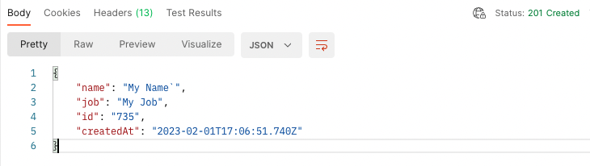

:::note

- This page should be use as reference for specification files.
- This page is subject to change. It is requested to check this page frequently.

:::

:::note

Case-wise more example can be found in [https://github.com/chkware/cli](https://github.com/chkware/cli/blob/main/tests/resources/storage/sample_config/bitcoin-usd-testcase.chk) repository

:::

[Testcase specification document reference](/references/testcase-reference)

### A minimal Testcase with in-file request

```yaml
---
version: "default:testcase:0.7.2"

request:
  url: "https://reqres.in/api/users"
  method: POST
  body[json]: { "name": My Name, "job": My Job }

spec:
  asserts:
    - { type: AssertEqual, actual: "{$_response.code}", expected: 201 }
    - { type: AssertIsMap, actual: "{$_response.body}" }
```

The above testcase spec. doc define a request that makes a `POST` call to `https://reqres.in/api/users` URL with a body `{"name": "My Name", "job": "My Job"}`.

After the request server responses with following:



On the `asserts`, we are asserting that

- The response code is 201, or the resource was created
- The response if a map / dictionary

Assertion [reference with examples](/references/testcase-reference#assertions) can be found here.

### A minimal Testcase with out-file request

A http spec. doc can be written on separate file, that does same as above request. Let's call it `same-request.chk`. The http spec. doc by default exposes `_response` object.

```yaml
# file: same-request.chk
---
version: "default:http:0.7.2"

request:
  url: "https://reqres.in/api/users"
  method: POST
  body[json]: { "name": My Name, "job": My Job }
```

Now we can point out above file to execute before make assertions like below (assuming both file lives on same directory).

```yaml
# file: same-testcase.chk
---
version: "default:testcase:0.7.2"

spec:
  execute:
    file: "./same-request.chk"
  asserts:
    - { type: AssertEqual, actual: "{$_response.code}", expected: 201 }
    - { type: AssertIsMap, actual: "{$_response.body}" }
```

Please notice the `_response` in the testcase doc. This variable is available after the request gets executed as local variable.

### A Testcase with out-file request passing data

To pass data from a testcase spec. doc to a http spec. doc, we first need to add some variables. These variables can also have some default value. Say in the following case, we defined `name` and `job` variables with default value. So, if no value passed these values will be passed to server as part of request body.

```yaml
# file: same-request.chk
---
version: "default:http:0.7.2"

variables:
  name: My Name
  job: My Job

request:
  url: "https://reqres.in/api/users"
  method: POST
  body[json]: { "name": "{$name}", "job": "{$job}" }
```

Now we can point out which value we want to pass using `with` statement in `execute` block.

```yaml
# file: same-testcase.chk
---
version: "default:testcase:0.7.2"

spec:
  execute:
    file: "./same-request.chk"
    with:
      name: Her Name
      job: Her Job
  asserts:
    - { type: AssertEqual, actual: "{$_response.code}", expected: 201 }
    - { type: AssertIsMap, actual: "{$_response.body}" }
```

Please notice that if we do not set a `with` then request will be sent with default value.

Assertion [reference with examples](/references/testcase-reference#assertions) can be found here.
