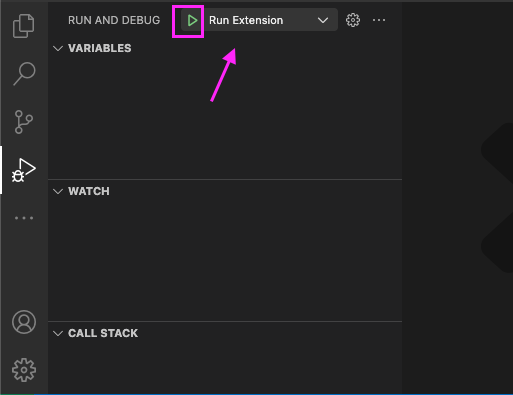

### Local development setup for *CHKware* extension

#### Download code

- Create a fork of `https://github.com/chkware/vscode-ext` repository.

- Clone the repository in your local machine.

#### Setup for development

- Run following to install dependencies:

  ```shell
  npm install
  ```
- Start implementation.

#### Testing and Debugging

- Goto *Run and Debug* <br /><br />
  

- Then hit play selecting *Run Extension* <br /><br />
  

- Wait for the new window to be opened

- Open command palette by pressing `ctrl` + `shift` + `p`

- Search for *CHKware* commands <br /><br />
  

- After code changes, run `Developer: Reload Window` in the new window from command palette

- After development exit debug mode <br /><br />
  
