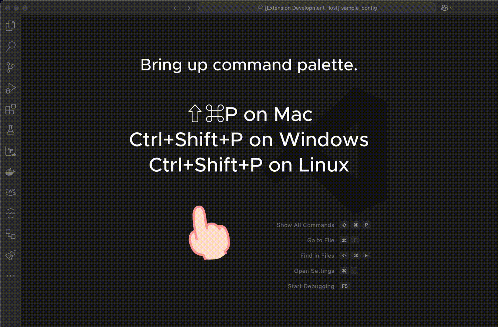

:::warning

[CHKware vscode extension](https://marketplace.visualstudio.com/items?itemName=chkware.chkware) on visual studio marketplace it not updated.

:::
:::success

Latest vscode extension can be found on project's Github [release page](https://github.com/chkware/vscode-ext/releases).

:::

*CHKware VS Code extension* helps to write `.chk` files quick. It contains regular used snippets those makes test spec. development quick.

### Install *CHKware* extension for Visual Studio Code

Get started writing *CHKware* configurations with VS Code doing following steps:

- Step 1: [Setup CHKware cli](/docs/setup), if you haven't done so already.

- Step 2: Download the [*CHKware* extension](https://github.com/chkware/vscode-ext/releases) for VS Code from Github project release page.

- Step 3: Bring up command palette.

    - Use `Cmd+Shift+P` on macOS
    - Use `Ctrl+Shift+P` on Windows
    - Use `Ctrl+Shift+P` on Linux

- Step 4: Search for **`Extensions: Install from VSIX`**. Selecting the option should open a file opener dialog in your operating system.

- Step 5: Select the **`chkware-vscode-ext.vsix`** file from the download location to load the extension.

---

### Using *CHKware* extension for Visual Studio Code

Using VS Code command palette you can quickly select a snippet from added samples.

- Use `Cmd+Shift+P` on macOS, `Ctrl+Shift+P` on Windows, and `Ctrl+Shift+P` on Linux to bring up command palette.
- Select a sample you need to use. More information about [vscode extension](https://github.com/chkware/vscode-ext/blob/main/README.md) here.

