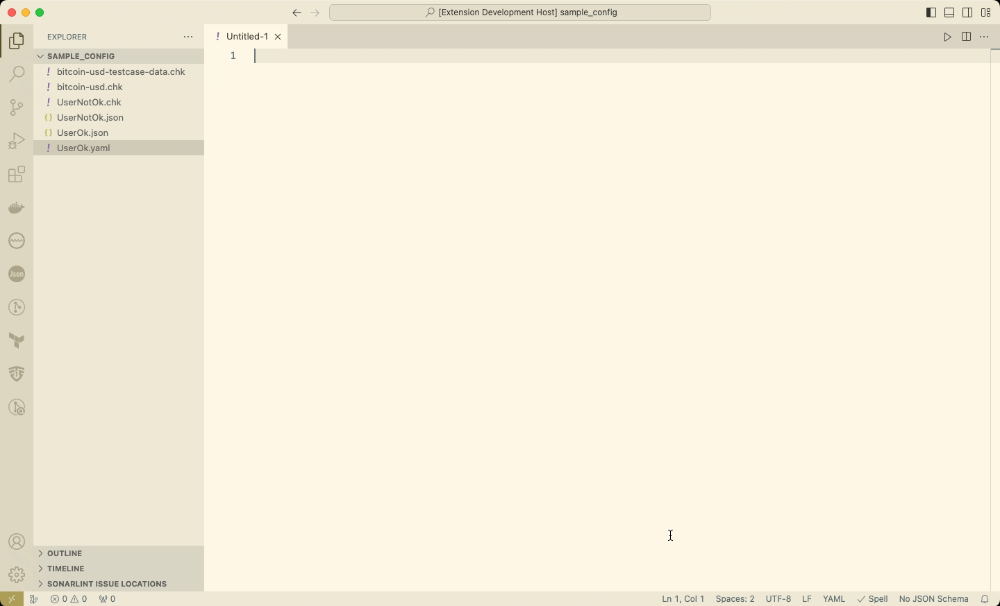

### Install _CHKware_ extension for Visual Studio Code

Get started writing *CHKware* configurations with VS Code doing following steps:

- Step 1: Install [chkware](/docs/setup), if you haven't done so already.

- Step 2: Install the [*CHKware* extension](https://marketplace.visualstudio.com/items?itemName=chkware.chkware) for VS Code

- Step 3: New to *CHKware*? Read the *CHKware* [quick start](/docs/quick-start) guide here.

---

### Using *CHKware* extension for Visual Studio Code

Using VS Code command palette you can quickly select a snippet from added samples.

- Use `Cmd+Shift+P` on macOS, `Ctrl+Shift+P` on Windows, and `Ctrl+Shift+P` on Linux to bring up command palette.
- Select a sample you need to use. More information about [vscode extension](https://github.com/chkware/vscode-ext/blob/main/README.md) here.

