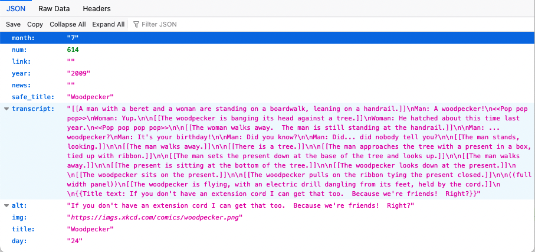

:::note
- **Prerequisite**: First, [setup **CHKware**](/setup) to continue
- Find [More `testcase` examples](/examples/testcase-examples) here
:::

Let's continue to test our [_XKCD.com JSON API http client_](/tutorials/http-client) that we covered earlier. Please do as follows:

- Create a file called `xkcd-joke-test.chk` on the same directory where your created `xkcd-joke.chk` early.
- Open `xkcd-joke-test.chk` file, and add following spec. 

  As you can see, it's possible to combine both `http` request and `testcase` spec on same file. See [Testcase example](/examples/testcase-examples) for other asserts you can write.

  ```yaml
  ---
  version: default:testcase:0.7.2
  request:
    url: https://xkcd.com/614/info.0.json
    method: GET

  spec:
    asserts:
      - {type: AssertEqual, actual: $_response.code, expected: 200}
      - {type: AssertIsInt, actual: $_response.body.num}
      - {type: AssertEqual, actual: $_response.body.year, expected: 2009}
  ```

  Here notice the `verison` string **`version: default:testcase:0.7.2`**, this is important for this specification to be a [testcase specification](/references/testcase-reference).

- Open a terminal. Hit enter after writing following command on terminal.

  ```bash
  chk testcase xkcd-joke-test.chk
  ```

  You'll get output like following. Data will vary depending on the day you are doing it.

  ```bash
  File: xkcd-joke-test.chk

  - Making request [Success]
  - Process data for assertion [Success]
  - Prepare exposable [Success]

  ---
  -> Running `AssertEqual` on `$_response.code` [Success]
  -> Running `AssertIsInt` on `$_response.body.num` [Success]
  -> Running `AssertEqual` on `$_response.body.year` [Success]
  ```

  You just tested a live API :rocket::star2:.

  Let us go through the testcase spec. we wrote. If you call the API `https://xkcd.com/614/info.0.json` in any Firefox, the response will be shown like this:

  

  Please notice that the response contains node `num` and `year` on it. Thus on the spec. in `asserts` we are doing three assertions.
  - If response we got, has code 200; otherwise whether the response was successful.
  - If response body contains a node `num`, and does it hold an integer value.
  - If response body contains a node `year`, and does it hold value `2009`.

- Now If you add `--result` or `-r` flag to the command then it should show you the result in formatted output.
  ```bash
  chk testcase xkcd-joke-test.chk --result
  ```
  
  You should be able to see following if no exception occurs.

  ```bash 
  -> Running `AssertEqual` on `$_response.code` [Success]
  -> Running `AssertIsInt` on `$_response.body.num` [Success]
  -> Running `AssertEqual` on `$_response.body.year` [Success]
  ```

- These above response are coming as formatted output. If you want to see all JSON just pass the `--no-fomat` or `-nf` option flag.
  ```bash
  chk testcase xkcd-joke-test.chk --result --no-format
  ```
  and response looks like this.

  ```bash
  [[{"name": "AssertEqual", "name_run": "AssertEqual_bf476fda9fa211ed8f6dca2350850d2e", "actual_original": "$_response.code", "is_success": true, "message": "", "assert_fn": ""}, {"name": "AssertIsInt", "name_run": "AssertIsInt_bf4783309fa211ed8f6dca2350850d2e", "actual_original": "$_response.body.num", "is_success": true, "message": "", "assert_fn": ""}, {"name": "AssertEqual", "name_run": "AssertEqual_bf4784709fa211ed8f6dca2350850d2e", "actual_original": "$_response.body.year", "is_success": true, "message": "", "assert_fn": ""}]]
  ```
---

This way you can write API feature test. More [testcase examples](/examples/testcase-examples) here.

:wink::tada::confetti_ball:
